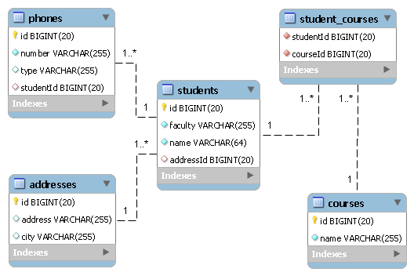

JPA Student Demo Application
===================================

This tutorial shows how can be used __Java Persistence API (JPA)__ to implement basic CRUD operations on a database.


Database configuration
----------------------
In order to run this application you must create a MySQL database called `jpastudent` and add a database user to connect to database.
In our case we use default `root` without password. The database connection details can be changed from file `src/main/resources/META-INF/persistence.xml`:

```xml 
<?xml version="1.0" encoding="UTF-8"?>
<persistence version="2.1"
  xmlns="http://xmlns.jcp.org/xml/ns/persistence" xmlns:xsi="http://www.w3.org/2001/XMLSchema-instance"
  xsi:schemaLocation="http://xmlns.jcp.org/xml/ns/persistence
                                 http://xmlns.jcp.org/xml/ns/persistence/persistence_2_1.xsd">

  <persistence-unit name="student-punit" transaction-type="RESOURCE_LOCAL">
	<provider>org.hibernate.jpa.HibernatePersistenceProvider</provider>
    <properties>
      <!-- Configuring JDBC properties -->
      <property name="javax.persistence.jdbc.url" value="jdbc:mysql://localhost:3306/jpastudent" />
      <property name="javax.persistence.jdbc.user" value="root" />
      <property name="javax.persistence.jdbc.password" value="" />
      <property name="javax.persistence.jdbc.driver" value="com.mysql.cj.jdbc.Driver" />

      <!-- Hibernate properties -->
      <property name="hibernate.dialect" value="org.hibernate.dialect.MySQLDialect" />
      <property name="hibernate.hbm2ddl.auto" value="update" />
      <property name="hibernate.format_sql" value="true" />
      <property name="hibernate.show_sql" value="true" />
      <property name="hibernate.connection.release_mode" value="on_close" />
    </properties>
  </persistence-unit>

</persistence>
```

Database Schema
---------------
The following image shows the database schema used in this application: 



A _student_ has an address and one or more _phones_. Each _student_ is enrolled to a set of _courses_.
